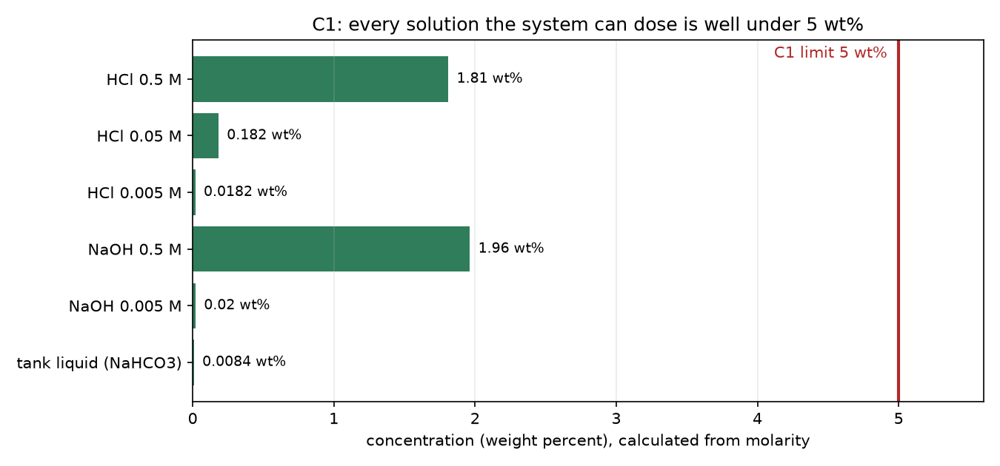

# C1 · Approved dilute reagents (max 5 wt%)

| | |
|---|---|
| **Binder test ID** | CHE-AT-03 |
| **Department / type** | CHE · Constraint |
| **Verdict** | **MET = 1.96 wt%** (limit 5 wt%), by calculation. Paperwork to attach: approval scan, label photos, titration (see the end) |
| **Evidence level** | Calculation from the bottle molarities, plus the gateway's bottle list |

| No. | Constraint (full text) | Test procedure | Result / evidence |
|---|---|---|---|
| **C1** | During all neutralization and recovery operations, the prototype shall use only lab-approved dilute acid and base solutions with concentrations not exceeding 5 wt%. | 1. List every solution the system can dose. The gateway accepts only four bottle names, so nothing else can be dosed through it: `ACID_BULK` 0.5 M HCl, `ACID_FINE` 0.005 M HCl, `BASE_BULK` 0.5 M NaOH, `BASE_FINE` 0.005 M NaOH. The 0.05 M HCl bottle was used by hand for setup and for the INT-S1 test. | Five solutions, listed in `data/wt_percent_calculation.csv`. Any other bottle name is rejected by the gateway (`code/gateway/src/chemshield_gateway/config.py`). |
| | | 2. Calculate each solution's concentration: wt% = molarity × molar mass ÷ (10 × density). Script: `code/wt_percent.py`. | HCl 0.5 M = **1.81 wt%** · HCl 0.05 M = 0.18 wt% · HCl 0.005 M = 0.018 wt% · NaOH 0.5 M = **1.96 wt%** · NaOH 0.005 M = 0.020 wt%. The tank liquid (0.42 g NaHCO₃ in 5 L) is 0.0084 wt%. |
| | | 3. Compare with the 5 wt% limit. | The strongest solution is 1.96 wt%, which is 39% of the limit. See `plots/C1_wt_percent_vs_limit.png`. |
| | | 4. Supervisor's approval of the solutions (C1 asks for "lab-approved"). | The CHE supervisor's approval was confirmed by Belal on 1 Oct 2026. **Scan to add:** `data/approval_scan.*` (name of the approver and the date). |
| | | 5. Label every bottle with name, molarity and hazard sign, and photograph them. | **Photos to add:** `data/bottle_labels.jpg`. |
| | | 6. Titrate 10.00 mL of each 0.5 M bottle against the lab standard to confirm its molarity. | **Titration values to add:** `data/titration.csv` (volume of standard used, calculated molarity). |

## Verdict

**MET.** Every solution the system can dose is at or below 1.96 wt%, which is under the 5 wt% limit, and the gateway cannot dose anything outside the four listed bottles.

## Still to attach (done in the lab, not yet recorded here)

| File to drop into `data/` | What it shows |
|---|---|
| `approval_scan.*` | The CHE supervisor's signed approval: who, when, which solutions |
| `bottle_labels.jpg` | Photo of each bottle with its label |
| `titration.csv` | Measured molarity of the 0.5 M NaOH and the 0.05 M HCl bottles |

## Plots

*Concentration of every solution the system can dose, against the 5 wt% limit.*

## Files in this folder

- `data/wt_percent_calculation.csv`: the calculation, one row per solution, with the molar mass and density used.
- `plots/C1_wt_percent_vs_limit.png`: bar chart of the concentrations against the 5 wt% line.
- `code/wt_percent.py`: the calculation; `code/SOURCE.md`: the gateway configuration that limits the bottles.

## Notes

- Densities are rounded textbook values for dilute solutions; the answer only has to be under 5, and the strongest solution is at 1.96, so the rounding does not matter.
- The molarities are those the lab prepared. The titration (step 6) is what confirms them.
