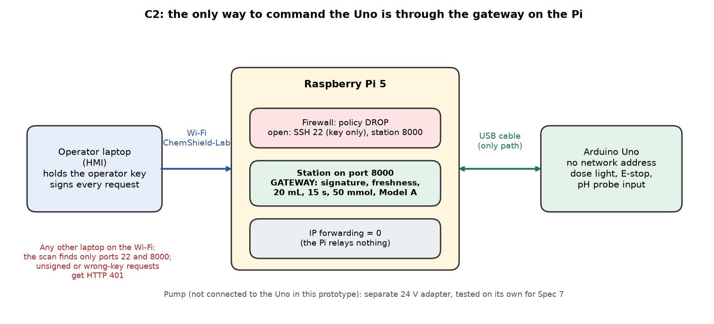

# C2 · The gateway is the sole control path

| | |
|---|---|
| **Binder test ID** | ICS-AT-01 |
| **Department / type** | ICS · Constraint |
| **Verdict** | **PASS: MET** = only ports 22 and 8000 open, 401 for every unsigned or wrong-key request, SSH password login refused, IP forwarding 0, no dose reached the Uno. 8 of 8 checks, in two separate runs |
| **Evidence level** | Real rig: Raspberry Pi 5 with the Uno on USB, tested from a laptop, 4 Oct 2026 |

| No. | Constraint (full text) | Test procedure | Result / evidence |
|---|---|---|---|
| **C2** | All actuator commands must pass through the ChemShield gateway as the sole authorized control path during testing and demonstration. | 1. Set up. The station (gateway, Model A, planner, Uno link) runs on the Pi and the firewall is on (`gateway/firewall/c2_network.sh`). Run 1: the Pi on the phone hotspot (17:28 UTC). Run 2: the Pi on its own Wi-Fi `ChemShield-Lab` at 10.42.0.1, the booth setup (17:44 UTC). | Both runs reached the station. |
| | | 2. Port scan from the laptop with nmap: 1,141 TCP ports (every well-known port, plus MQTT, OPC UA, VNC, the 8000 range and the industrial-protocol ports). | Open ports: **22 and 8000 only**, in both runs. The other 1,139 ports are filtered. Scan time 59 s. |
| | | 3. Send requests to the station's door (port 8000) that do not pass the gateway's checks: an unsigned dose, a dose signed with the wrong key, an unsigned operator HALT, and a body that is not a command. | **401** (MISSING_SIGNATURE) · **401** (INVALID_HMAC) · **401** · **400**. |
| | | 4. Try to log in to the Pi over SSH with a password. | `Permission denied (publickey)`: the server offers **public key only**. |
| | | 5. On the Pi, read the routing and firewall settings and what is listening. | `ip_forward` = **0**; INPUT policy **DROP**; FORWARD policy **DROP**. Listening sockets: 22, 8000, and a DNS port on 10.42.0.1 that the firewall blocks (it is not in the scan's open list). |
| | | 6. Check that none of this reached the actuator side: the accepted-dose counter, a dose waiting to be added, and the Uno's light, before and after the attempts. | Accepted doses **3 → 3**, no dose pending, Uno light "locked" (the slow recovery blink), never "dose". |
| | | 7. The Uno itself has no network address. It hangs off the Pi's USB cable, and the pump is not connected to it in this prototype. | Design fact; see `plots/C2_network_and_trust_boundary.png`. |

## Verdict

**PASS.** The only way to command the Uno is the station on the Pi, and every dose request it accepts must be signed with the operator key and pass the gateway's checks. All 8 automated checks passed in run 1 and in run 2.

## How to repeat it (about 1 minute)

```
.venv/bin/python -m hmi.c2_check --pi 10.42.0.1 --ssh-key ~/.ssh/id_ed25519_second --out evidence/02_C2_gateway_sole_control_path/data/my_run
```

The Pi's own Wi-Fi and firewall are switched on with `bash gateway/firewall/c2_network.sh on <password>`; see `../SETUP.md`.

## Plots


*The network, and where the trust boundary is.*

## Files in this folder

- `data/run1_phone_hotspot/ICS-AT-01_c2_check.txt` and `.json`: the report of run 1, with the raw nmap output, the SSH attempt and the Pi's settings at the end.
- `data/run2_pi_own_wifi/ICS-AT-01_c2_check.txt` and `.json`: the same for run 2, on the booth network.
- `data/unit_tests_c2.txt`: the automated tests behind the check (firewall script dry runs, the check itself, the station's 401): 9 passed.
- `plots/C2_network_and_trust_boundary.png`: the network and where the trust boundary is.
- `code/`: the gateway, the firewall script, the network check (`hmi/c2_check.py`) and the station's server.

## Notes

- **The 3 accepted doses** in step 6 are the Pi's own recovery planner reacting to a false alarm: the probe was unplugged, so its reading floated below pH 6. They happened before the checks started. The counter did not change while the attempts ran.
- The scan covers 1,141 ports, not all 65,535: a full scan through the phone hotspot did not finish in 10 minutes. The firewall policy (DROP) covers the rest, and step 5 reads that policy from the Pi.
- The scan is TCP. UDP port 67 (DHCP) is open on the Wi-Fi interface by design, so laptops can join the Pi's network.
- The Pi's firewall rules do not survive a reboot, and NetworkManager's Wi-Fi can switch IP forwarding back on. `c2_network.sh fw` puts both right; run it after every reboot (`../SETUP.md`).
