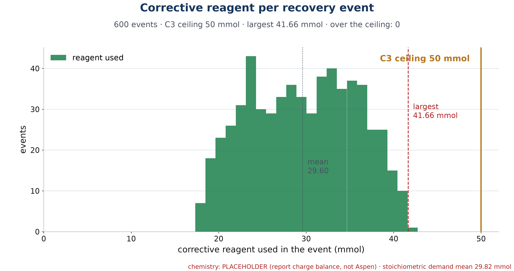

# C3 · At most 50 mmol of reagent per recovery

| | |
|---|---|
| **Binder test ID** | ISE-AT-01 |
| **Department / type** | ISE · Constraint |
| **Verdict** | **PASS: MET = 41.7 mmol** at most per event (limit 50), over 600 simulated recoveries, and the gateway refuses any dose that would pass 50 mmol |
| **Evidence level** | Simulation (600 events) and software tests. A live total from the real rig is still to add |

| No. | Constraint (full text) | Test procedure | Result / evidence |
|---|---|---|---|
| **C3** | Recovery from an unsafe dosing event shall consume no more than 50 mmol of reagent. | 1. Run the 600-event simulation: random acid and base upsets of 40 to 80 mL of 0.5 M reagent into 4.8 to 5.2 L, each recovered by the redosing planner. `python -m redosing.run_all` (seed 261). Read the reagent used per event. | Largest event **41.664 mmol**, mean 29.6 mmol, **0 of 600 events over 50 mmol**. 0 escalations. `data/batch_600_events.csv`, `plots/C3_reagent_per_event_histogram.png`. |
| | | 2. Check that the gateway itself enforces the limit, whatever the sender claims. It computes each dose's mmol as volume × the bottle's molarity, keeps a total per event, and rejects a dose that would pass 50 mmol (`EVENT_MMOL_LIMIT`). | `data/unit_tests_gateway_c3.txt`: 8 tests passed, including eleven 10 mL doses of 0.5 M NaOH (55 mmol): the 11th is rejected. |
| | | 3. Run a full recovery through the station and the gateway on a simulated tank, with a 40 mL acid upset. | Test passed: the event closes in under 300 s with at most 50 mmol used, and every dose came from the planner. A manual dose past 50 mmol during the recovery is rejected. |
| | | 4. Real tank: after the unsafe dose of INT-S1, add each "Dose now" the HMI shows and read "Event reagent x / 50 mmol" when the event closes. | **To add.** The 4 Oct rig run was stopped before any recovery dose was added. |

## Verdict

**MET.** In 600 simulated recoveries the largest used 41.7 mmol. Even if the planner asked for more, the gateway would refuse the dose that passes 50 mmol.

## Plots

*Reagent used in each of the 600 simulated recoveries, against the 50 mmol limit.*

## Files in this folder

- `data/batch_600_events.csv`: one row per simulated event (upset size, doses, mmol used, recovery time, end pH).
- `data/batch_600_events_traces.csv`: the pH trace of each event.
- `data/batch_summary_all_numbers.json`: the summary numbers of the batch.
- `data/unit_tests_gateway_c3.txt`: the test output for steps 2 and 3.
- `plots/C3_reagent_per_event_histogram.png`: reagent per event against the 50 mmol line.
- `code/`: the redosing planner, the simulator, the gateway's mmol counter and the station's recovery loop.

## Notes

- **The pH table is a placeholder** (a closed carbonate model of the baking-soda water) until the Aspen export arrives; every file says `chem_source = PLACEHOLDER`. The batch is re-run with one command, `python -m redosing.run_all`, when the Aspen table is in `sim/aspen_tables/`.
- The batch assumes a dosing speed of 300 mL/min (`DOSE_SPEED_ML_PER_MIN` in `sim/model.py`), faster than hand dosing; it changes the time of a recovery, not the amount of reagent.
- The event counter also counts planner doses that were accepted but not yet added by hand.
