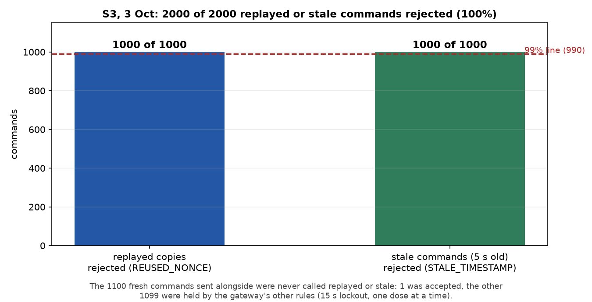
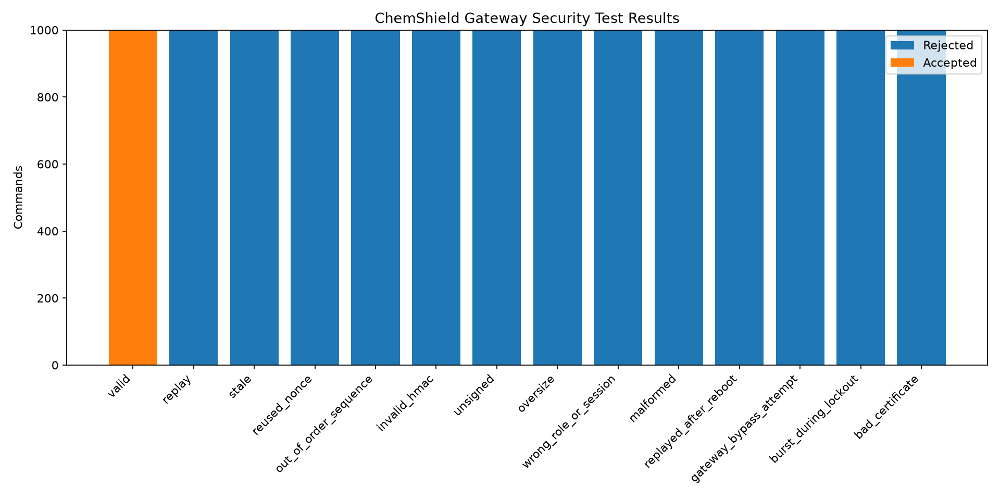

# Spec 3 · Replayed and stale commands are rejected

| | |
|---|---|
| **Binder test ID** | ICS-AT-02 |
| **Department / type** | ICS · Specification (extra: ICS's satisfactory pair is C2 + S4) |
| **Verdict** | **PASS: MET = 2,000 of 2,000 (100%)** replayed or stale commands rejected (limit 99%); none reached the Uno |
| **Evidence level** | The real station code (gateway + Model A) on a laptop with a simulated tank, attacked over HTTP, 3 Oct 2026. A repeat against the Pi over Wi-Fi is still to do |

| No. | Specification (full text) | Test procedure | Result / evidence |
|---|---|---|---|
| **S3** | In the defined validation scenarios, the security layer shall reject at least 99% of replayed or stale control commands. | 1. Start the station and attack it over HTTP with a client that holds the operator key, like a real operator would. | Station reachable; counters read from `/api/state` before and after each run. |
| | | 2. Replay: send 1,000 fresh signed commands, each immediately followed by an exact copy of itself. `python -m hmi.attack_station --mode replay-now --n 1000` | The copies: **1,000 of 1,000 rejected** as `REUSED_NONCE` (replayed), in 1.6 s. |
| | | 3. Stale: send 1,000 signed commands dated 5 s in the past. `--mode stale --age 5 --n 1000` | **1,000 of 1,000 rejected** as `STALE_TIMESTAMP`, in 0.9 s. |
| | | 4. Control: send 100 commands dated 1 s ago (still fresh). `--mode stale --age 1 --n 100` | **0 of 100 called stale or replayed.** The gateway rejected them for a different reason (`MIXING_LOCKOUT`, the 15 s wait started by the one dose it had accepted), so a command only 1 s old is not treated as stale. |
| | | 5. Compare with the HMI's counters, then export the audit log and check its hash chain. `python -m hmi.verify_log` | HMI counters: Replayed +1,000, Stale +1,000, matching the script. Audit log: 3,103 records, **CHAIN OK**. **None of the 2,000 replayed or stale commands was forwarded to the Uno.** The one command the gateway accepted (`ACCEPT 1`) was the very first original, a valid 1 mL dose, which shows that valid commands still get through. |
| | | 6. Supplementary: Khalid's in-process gateway test (30 Sep), 14 attack categories of 1,000 commands each, run against the gateway code directly. | Valid 1,000 of 1,000 accepted; every attack category 1,000 of 1,000 rejected (`data/in_process_gateway_test_30Sep/`). |

## Verdict

**MET.** 2,000 of 2,000 replayed and stale commands were rejected (100%, limit 99%), none of them reached the actuator side, and a valid command was still accepted.

## Plots

*Replayed and stale commands rejected in the 3 Oct run.*

*Supplementary: the 30 Sep in-process test, 14 attack types of 1,000 commands each.*

## Files in this folder

- `data/laptop_run_3Oct/ICS-AT-02_attack_summary.txt`: the three attack runs, with counts by reason.
- `data/laptop_run_3Oct/ICS-AT-02_audit.jsonl`: every decision, hash-chained (3,103 records).
- `data/laptop_run_3Oct/ICS-AT-02_verify_log.txt`: the chain check (CHAIN OK).
- `data/in_process_gateway_test_30Sep/`: the 14-category test, summary and all 14,000 commands.
- `data/unit_tests_s3.txt`: the unit tests of replay, stale and forged commands (2 passed).
- `plots/S3_attack_results.png` and `plots/in_process_gateway_test_summary.png`.
- `code/`: the gateway (signature, freshness, nonce, sequence checks), the attack script, the log checker.

## Notes

- A command is "replayed" if its one-time number (nonce) or ID was used before, and "stale" if its timestamp is more than 2 s from the Pi's clock. The laptop and Pi clocks must therefore agree; `python -m hmi.clock_sync` sets and checks that.
- The run used a simulated tank behind the same gateway and Model A code as the Pi. The same command against the Pi's address repeats it over the Pi's Wi-Fi.
