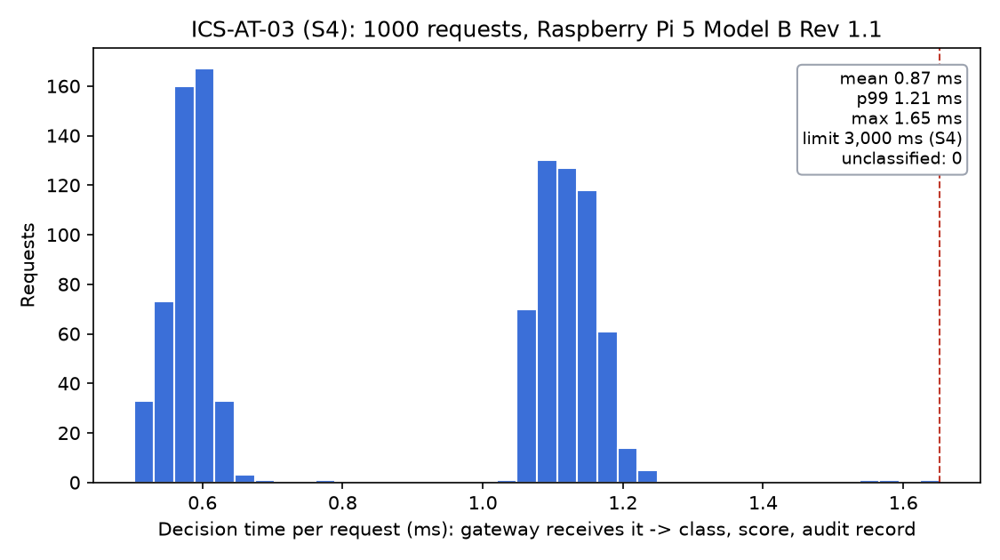

# Spec 4 · Event class and risk score within 3 s

| | |
|---|---|
| **Binder test ID** | ICS-AT-03 |
| **Department / type** | ICS · Specification |
| **Verdict** | **PASS: MET = 1.65 ms** slowest of 1,000 decisions on the Raspberry Pi 5 (limit 3,000 ms); every request got a class and a score |
| **Evidence level** | Real hardware: Raspberry Pi 5 Model B, 3 Oct 2026; plus decisions on the live rig, 2 Oct |

| No. | Specification (full text) | Test procedure | Result / evidence |
|---|---|---|---|
| **S4** | For each detected abnormal event, the AI threat-triage module shall assign an event class and risk score within 3 s after detection. | 1. On the Pi, send 1,000 signed dose requests through the real gateway with the real Model A (mix of normal, harmful, recovery and lost-probe cases). `python -m model_a.latency_test --n 1000` | **1,000 of 1,000** got a class and a score. Labels: 529 acceptable, 277 harmful, 194 uncertain. Decision time: mean **0.87 ms**, p99 1.21 ms, **max 1.65 ms**. |
| | | 2. Time per request = from the gateway receiving the request to its decision with class, score and audit record written. | Limit 3,000 ms: the slowest decision used **0.055%** of it. See `plots/S4_decision_time_histogram_raspberry_pi_5.png`. |
| | | 3. Timeout check: freeze Model A for 3 requests. | **3 of 3** came back UNCERTAIN within 100.4 ms and were blocked (fail closed). |
| | | 4. Real rig, 2 Oct (probe in the tank at pH 7.8): request 10 mL of 0.5 M NaOH, then 10 mL of 0.005 M NaOH from the HMI. | 0.5 M: **HARMFUL**, risk 1.00, 1.27 ms, blocked (it would push the tank to pH 10.5). 0.005 M: **ACCEPTABLE**, risk 0.005, 2.23 ms, accepted. `data/rig_run_2Oct/model_a_decisions.csv`. |
| | | 5. Event class when an unsafe event is confirmed (INT-S1 rig run, 4 Oct). | The station labels the event "Unsafe acid event (pH below 6.0)" in the same millisecond as RECOVERY (`../09_INT-S1_recovery_mode_within_2s/data/rig_run_4Oct/audit.jsonl`). |

## Verdict

**MET.** The class and risk score arrive about 1,800 times faster than the limit, on the target hardware.

## Plots

*Decision time of the 1,000 requests on the Raspberry Pi 5. The dashed line marks the slowest (1.65 ms); the limit is 3,000 ms.*

## Files in this folder

- `data/pi_run_3Oct/ICS-AT-03_latency.csv`: one row per request (scenario, class, score, decision time).
- `data/pi_run_3Oct/ICS-AT-03_summary.json`, `ICS-AT-03_machine_info.txt` (shows "Raspberry Pi 5 Model B Rev 1.1"), `ICS-AT-03_timeout_check.csv`, `model_a_decisions.csv`.
- `data/laptop_dry_run_30Sep/`: the same test on the Mac (max 1.8 ms), before the Pi existed.
- `data/rig_run_2Oct/`: audit log and Model A decisions from the first live rig session.
- `data/unit_tests_model_a.txt`: 17 tests passed (features, labels, fail-closed rules, the gateway's block).
- `plots/S4_decision_time_histogram_raspberry_pi_5.png`.
- `code/`: Model A (features, label rules, training, inference), the model card, the timing test and the gateway client.

## Notes

- **How the model decides:** a physics rule predicts the pH after the dose from the pH table, and a small learned model scores what the rule cannot see (probe lag, drift, a sensor that does not respond). Anything it cannot judge is UNCERTAIN and blocked. Only ACCEPTABLE lets a dose through.
- **Accuracy on simulated test data** (model card, `code/model_a/artifacts/MODEL_CARD.md`): 95.8% of harmful doses blocked, 3.0% of good doses wrongly blocked. This spec only asks for speed.
- The timing test clears the 15 s lockout and the per-event mmol counter between requests; otherwise most of 1,000 back-to-back requests would be refused before reaching Model A.
- The 2 Oct rig run used the pH table of the baking-soda water; the table is a placeholder until the Aspen export.
