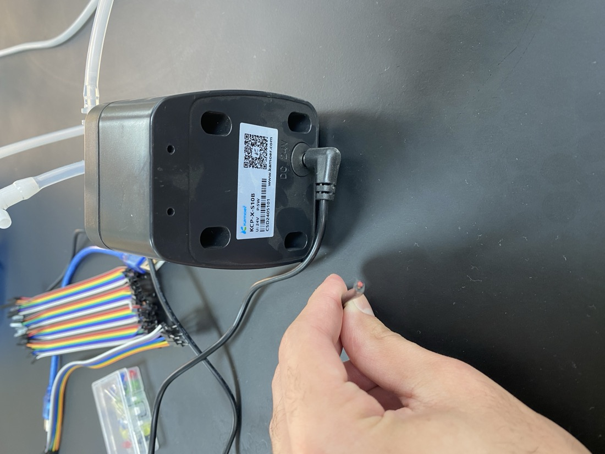
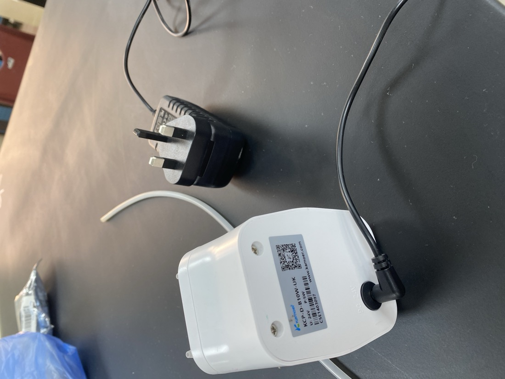

# Spec 7 · Pump maximum flow at or below 500 mL/min

| | |
|---|---|
| **Binder test ID** | CHE-AT-01 |
| **Department / type** | CHE · Specification |
| **Verdict** | **MET = 65 mL/min** rated maximum (limit 500 mL/min). The datasheet page and the three measured runs are to be attached |
| **Evidence level** | The pump's label and rating; a flow test on a balance done 3 Oct (numbers not yet recorded here) |

| No. | Specification (full text) | Test procedure | Result / evidence |
|---|---|---|---|
| **S7** | The selected dosing pump shall have a manufacturer-rated maximum flow capacity not exceeding 500 mL/min. | 1. Identify the pump and photograph its label. | Kamoer **KCP-X-S10B**, 24 V DC, 5 W peristaltic pump, with its own 24 V wall adapter. `data/pump_label_KCP-X-S10B_24V_5W.jpg`. A second Kamoer pump, KCP-D-B10W-UK (24 V, 5 W), is also in the lab: `data/pump_label_KCP-D-B10W-UK_24V_5W.jpg`. |
| | | 2. Read the manufacturer's rated flow for this model. | Adjustable **19 to 65 mL/min**, so the rated maximum is **65 mL/min**, which is 7.7 times below the limit. Source so far: the product listings of the KCP-X ([eBay](https://www.ebay.com/itm/326925050143), [Amazon](https://www.amazon.com/peristaltic-Control-Adjustable-Aquarium-Silicone/dp/B098RWZ4SV)). **To add:** the manufacturer's datasheet page (QR code on the label). |
| | | 3. Measure it. Power the pump from its own adapter only (it is not wired to the Uno), set the speed knob to MAX, put a beaker on the balance and tare it. Pump water into it for exactly 60 s and read the mass (1 g of water = 1 mL). | Run 1: ______ mL/min |
| | | 4. Repeat twice more. | Run 2: ______ · Run 3: ______ · Mean: ______ mL/min |

## Verdict

**MET on the manufacturer's rating (65 mL/min against 500).** The spec is about the rated capacity, so the rating decides it; the measured runs confirm that the pump on the bench behaves as rated.

## To add (done in the lab on 3 Oct, not yet recorded here)

| File to drop into `data/` | What it is |
|---|---|
| `datasheet_KCP-X-S10B.*` | The manufacturer's datasheet or manual page that states the flow range |
| `flow_test.csv` | The three 60 s runs: mass in g, time in s, mL/min |
| `flow_test_video.*` | Video of one run next to the balance |

## Pictures

*Label of the Kamoer KCP-X-S10B pump: 24 V, 5 W.*

*Label of the second Kamoer pump in the lab, KCP-D-B10W-UK: 24 V, 5 W.*

## Files in this folder

- `data/pump_label_KCP-X-S10B_24V_5W.jpg` and `data/pump_label_KCP-D-B10W-UK_24V_5W.jpg`: the two pump labels.
- No software is involved in this spec (`code/SOURCE.md`).

## Notes

- In this prototype the pump is **not connected** to the Uno or the Pi: doses are added by hand with syringes while the Uno's light shows the system's command. At the final design the Uno would switch the pump through a relay.
- 65 mL/min is slower than the 300 mL/min assumed by the simulation batch; the effect on recovery time is discussed in `../EXTRA_S6_recovery_within_300s/TEST_SHEET.md`.
