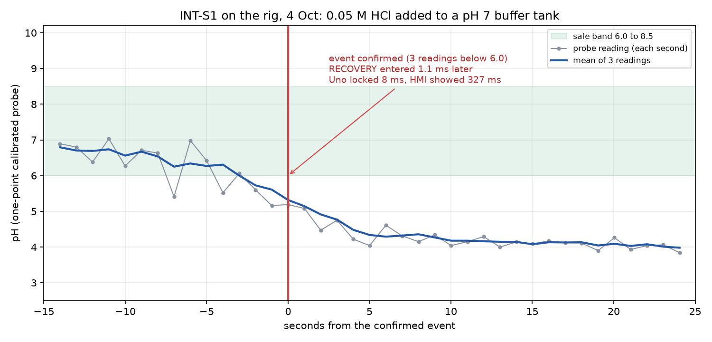
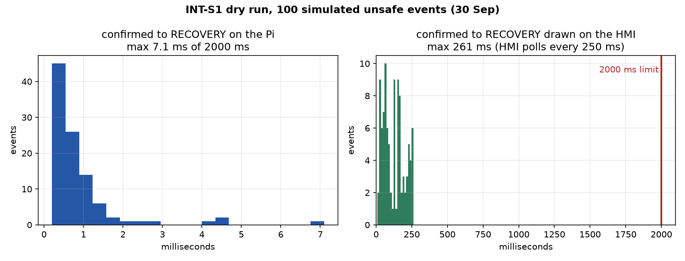

# INT-Spec 1 · Safe-recovery mode within 2 s of a confirmed unsafe event

| | |
|---|---|
| **Binder test ID** | INT-AT-01 |
| **Department / type** | Integrated · Specification |
| **Verdict** | **PASS: MET = 1.1 ms** from the confirmed event to RECOVERY (limit 2,000 ms); the Uno confirmed "dosing locked" at 8.1 ms and the HMI showed it at 327 ms |
| **Evidence level** | Real rig, 4 Oct 2026: real probe, Uno, Pi 5 and laptop HMI. Also 100 simulated events (30 Sep) |

| No. | Specification (full text) | Test procedure | Result / evidence |
|---|---|---|---|
| **INT-S1** | The integrated system shall enter safe-recovery mode within 2 s of confirming a successful unsafe dosing event. | 1. Set up the live system: the real pH probe in a pH 7 buffer standing in for the tank, the station running on the Pi (`--ph-source uno`), the HMI on the laptop. | HMI shows NORMAL, pH tagged PROBE, the Uno link alive. |
| | | 2. Make the unsafe dose: add 0.05 M HCl by syringe straight into the tank, not through the HMI, as if a bad command had got past the gateway. | The (noisy) reading, around 6.7, fell below 6.0 over about 20 s. `plots/INT-S1_rig_run_ph_trace.png`. |
| | | 3. The station confirms the event when 3 readings in a row are outside 6.0 to 8.5. | Event **E-0001** confirmed at 14:23:54.507 UTC on readings 5.6, 5.16 and 5.19. Class: "Unsafe acid event (pH below 6.0)". |
| | | 4. Read the timing from the HMI (Evidence, then Recovery-mode timing) and the audit log. | Confirmed to RECOVERY: **1.1 ms**. Confirmed to "Uno confirmed dosing locked": **8.1 ms** (the Uno's light slow-blinks). Confirmed to the HMI drawing the red banner: **326.7 ms**. `pass_2s = True`. |
| | | 5. Press HALT DOSING after reading the timing (the planner assumes a 5 L tank, so its doses are too big for a cup of buffer). Export the audit log and check its hash chain. | HALT recorded. Audit log: 57 records, **CHAIN OK**. |
| | | 6. Repeat 100 times in simulation: `python -m hmi.int_s1_batch --events 100` (a headless HMI polls the station every 250 ms). | **100 of 100** under 2 s. Switch to RECOVERY at most 7.1 ms; shown on the HMI mean 124 ms, at most 260.6 ms. |

## Verdict

**MET.** Recovery mode was entered 1.1 ms after the event was confirmed on the real rig, and 100 of 100 simulated events were under 2 s end to end including the HMI.

## Plots

*The live rig run, 4 Oct: the probe's pH through the confirmed event.*

*The 100 simulated events: time from confirmed to RECOVERY on the Pi, and to the HMI showing it.*

## Files in this folder

- `data/rig_run_4Oct/INT-AT-01_int_s1_timing.csv`: the timing row the HMI's download gives (all timestamps in UTC).
- `data/rig_run_4Oct/audit.jsonl`: the hash-chained log of the whole run (the event, RECOVERY, the Uno lock, the HMI showing it, the HALT).
- `data/rig_run_4Oct/INT-AT-01_ph_trend.csv`: the probe readings; `model_a_decisions.csv`: Model A's decisions.
- `data/laptop_dry_run_30Sep/`: the 100-event simulated batch (CSV, summary, station logs).
- `data/unit_tests_int_s1.txt`: unit tests of the switch to RECOVERY, HALT and the lost Uno link (3 passed).
- `plots/INT-S1_rig_run_ph_trace.png`: the real probe's pH through the confirmed event. `plots/INT-S1_dry_run_100_events.png`.
- `code/`: the station (event detector and recovery switch), the Uno link and firmware, the batch script.

## Notes

- **What is timed.** The spec starts the clock at "confirming" the event, which the station does on the third low reading. That takes about 2 s at one reading per second (the first of the three low readings came at 14:23:52.5, the third at 14:23:54.5). From the first low reading to recovery mode is therefore about 2.0 s; from confirmation it is 1.1 ms.
- After the event the planner proposed recovery doses of 0.5 M NaOH (about 8 mL). They were never added: they were cancelled when nobody confirmed them, then the operator halted. The "reagent_mmol" column of the timing row counts those accepted-but-never-added planner doses.
- The audit log also shows frequent "Uno lost the heartbeat" notices during this run. They did not affect the result; the cause has not been found yet (`../SETUP.md`, Part H).
- The probe had a one-point pH 7 calibration only, so the absolute pH values in the trace are approximate. The crossing of 6.0 and the timing do not depend on that.
