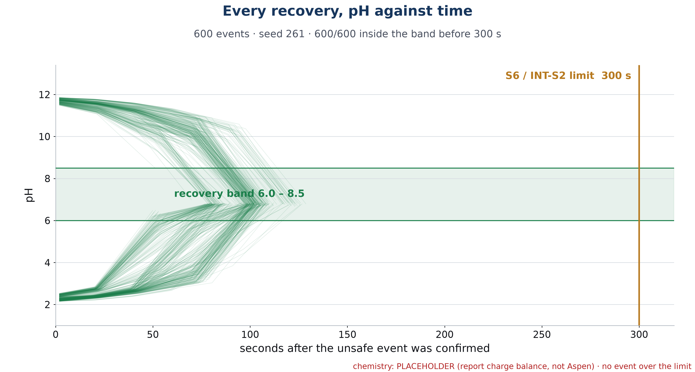

# EXTRA · INT-Spec 2 · pH restored to 6.0 to 8.5 within 5 minutes

| | |
|---|---|
| **Binder test ID** | INT-AT-02 |
| **Department / type** | Integrated · Specification · **EXTRA** (not in the list of nine) |
| **Verdict** | **PASS: MET** in simulation: 600 of 600 recoveries ended inside 6.0 to 8.5, the longest in **128.7 s** (limit 300 s). Not yet shown live on the real tank |
| **Evidence level** | Simulation (600 events) |

| No. | Specification (full text) | Test procedure | Result / evidence |
|---|---|---|---|
| **INT-S2** | Restore pH to 6.0–8.5 within 5 min after a successful unsafe event. | 1. Live (not done yet): after the unsafe dose of INT-S1, follow the HMI's recovery doses by syringe, stirring, and note the time when the pH is back inside 6.0 to 8.5. | **To add** from a recovery on the 5 L tank. |
| | | 2. Run the 600-event simulation: acid and base upsets of 40 to 80 mL of 0.5 M into a 4.8 to 5.2 L tank, each recovered by the planner. `python -m redosing.run_all` (seed 261). | `data/batch_600_events.csv`, one row per event. |
| | | 3. For each event, check that the pH ended inside 6.0 to 8.5 and read the time from the confirmed event to the pH entering and staying in the band. | **600 of 600** ended in the band. Recovery time: mean **95.5 s**, fastest 49.4 s, longest **128.7 s**. 0 escalations to the operator. |
| | | 4. Plot all 600 pH traces with the band and the 300 s line. | `plots/INT-S2_all_recovery_traces.png`. |
| | | 5. Repeat at the real pump's speed (65 mL/min) instead of the batch's 300 mL/min. | `../EXTRA_S6_recovery_within_300s/data/dose_speed_sensitivity.csv`: at 65 mL/min **598 of 600** ended inside the band, the longest recovery 183.2 s. The other two (events 130 and 571, both base upsets of about 40 mL) stopped at pH 8.58 and 8.62, which is 0.08 and 0.12 above the band's edge; the planner ended them without raising an escalation. |

## Verdict

**MET in simulation** at the batch's dosing speed (600 of 600). At the 65 mL/min pump speed the result is 598 of 600 (99.7%), so the spec is met in the large majority of events and the two misses are shown, not hidden.

## Plots

*All 600 recoveries: pH against time, with the safe band and the 300 s limit.*

## Files in this folder

- `data/batch_600_events.csv`, `batch_600_events_traces.csv`, `batch_summary_all_numbers.json`.
- `plots/INT-S2_all_recovery_traces.png`.
- `code/`: the simulator and the planner.

## Notes

- The pH table is a placeholder until the Aspen export (`chem_source = PLACEHOLDER`). Re-run `python -m redosing.run_all` then.
- The spec is written for one event, not as a percentage; the batch is the evidence that it holds across many different upsets.
- Recovery time here is "from the confirmed event to the pH being back inside the band and staying there". The controller itself declares the recovery finished later (after the final mixing hold and a triplicate read); both numbers are in the CSV (`recovery_time_s` and `controller_stop_s`).
