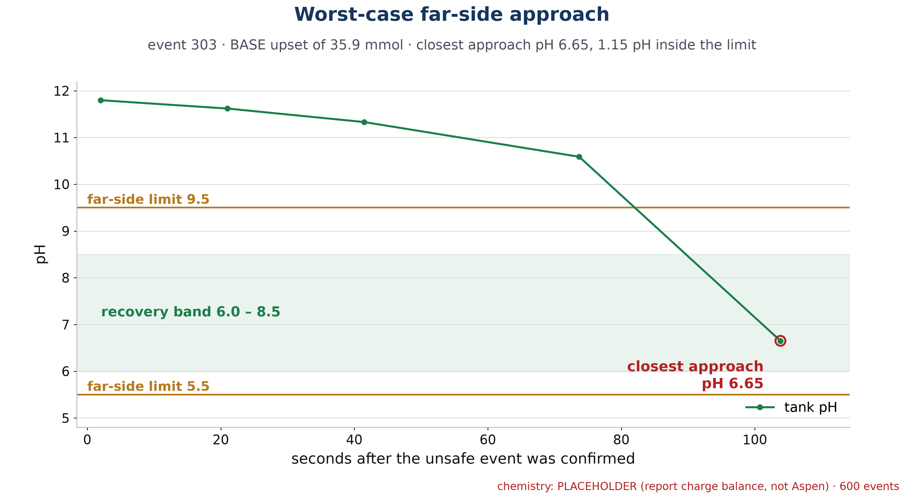

# EXTRA · INT-Spec 3 · No far-side excursion past pH 5.5 or 9.5

| | |
|---|---|
| **Binder test ID** | INT-AT-03 |
| **Department / type** | Integrated · Specification · **EXTRA** (not in the list of nine) |
| **Verdict** | **PASS: MET = 100%** (600 of 600) of simulated recoveries without overshooting to the other side (limit 90%); the worst case stopped at pH 6.65, 1.15 pH units inside the 5.5 limit |
| **Evidence level** | Simulation (600 events). Not yet shown live on the real tank |

| No. | Specification (full text) | Test procedure | Result / evidence |
|---|---|---|---|
| **INT-S3** | No far-side excursion beyond pH 5.5/9.5 in ≥90% of validated scenarios. | 1. Run the 600-event simulation: 343 acid upsets and 257 base upsets (40 to 80 mL of 0.5 M into a 4.8 to 5.2 L tank), each recovered by the planner. `python -m redosing.run_all` (seed 261). | `data/batch_600_events.csv`. |
| | | 2. For each event find how far the pH went to the other side: after an acid upset the highest pH reached, after a base upset the lowest. An excursion is above 9.5 after an acid upset, or below 5.5 after a base upset. | `data/INT-S3_far_side.csv`: one row per event, with the far-side peak and its margin from the limit. |
| | | 3. Count the events with no excursion. | **600 of 600 = 100%** (90% needs 540). |
| | | 4. Save the plot of the worst case. | Worst base event (#303): lowest pH **6.65**, margin 1.15 from 5.5. Worst acid event (#546): highest pH **6.95**, margin 2.55 from 9.5. `plots/INT-S3_worst_case.png`. |
| | | 5. Repeat at the real pump's speed (65 mL/min). | Still **600 of 600** without an excursion. Worst base peak 6.61 (margin 1.11), worst acid peak 7.01 (margin 2.49). |
| | | 6. Live (not done yet): during the recovery of INT-S1, watch the pH trace for any reading below 5.5 or above 9.5. | **To add** from a recovery on the 5 L tank. |

## Verdict

**MET in simulation.** No simulated recovery overshot; the closest was 1.15 pH units from the limit, at the batch's dosing speed and at 65 mL/min.

## Plots

*The closest approach to a far-side limit: event 303, a base upset, lowest pH 6.65 (limit 5.5).*

## Files in this folder

- `data/INT-S3_far_side.csv`, `batch_600_events.csv`, `batch_600_events_traces.csv`, `batch_summary_all_numbers.json`.
- `plots/INT-S3_worst_case.png`.
- `code/`: the simulator and the planner.

## Notes

- What the simulation varies from event to event: the upset direction and size, the tank volume, the pump's delivery error (about 1% bias and 1.2% random, plus 0.005 mL), the volume error (0.5%), and the pH reading noise (0.033 pH per reading). It assumes the probe itself reads true; the planner reserves 0.03 pH for calibration bias. A badly calibrated probe was not simulated, so on the rig the probe is calibrated before each run.
- The pH table is a placeholder until the Aspen export (`chem_source = PLACEHOLDER`).
