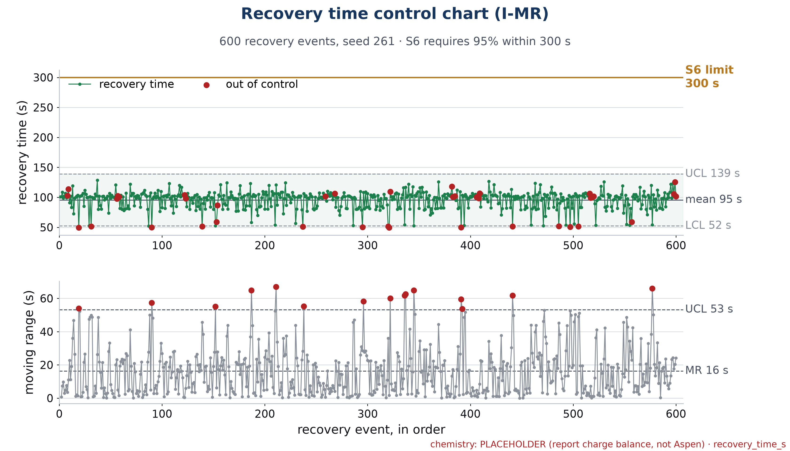

# EXTRA · Spec 6 · Recovery within 300 s

| | |
|---|---|
| **Binder test ID** | ISE-AT-02 |
| **Department / type** | ISE · Specification · **EXTRA** (a ready alternative to Spec 5 for ISE) |
| **Verdict** | **PASS: MET = 100%** (600 of 600) of simulated recoveries within 300 s (limit 95%); mean 95.5 s, slowest 128.7 s |
| **Evidence level** | Simulation (600 events). A live recovery on the real tank is not done |

| No. | Specification (full text) | Test procedure | Result / evidence |
|---|---|---|---|
| **S6** | Complete ≥95% of recovery events within 300 s. | 1. Run the 600-event simulation: random acid and base upsets (40 to 80 mL of 0.5 M), each recovered by the planner. `python -m redosing.run_all` (seed 261). | 600 events, `data/batch_600_events.csv`. |
| | | 2. For each event take the time from the confirmed event to the pH being back inside 6.0 to 8.5. | Recovery time: mean **95.5 s**, slowest **128.7 s**, fastest about 50 s. |
| | | 3. Count the events recovered within 300 s. | **600 of 600 = 100%** (95% needs 570). 0 escalations to the operator. |
| | | 4. Draw the times as an individuals and moving-range control chart. | `plots/S6_recovery_time_control_chart.png`: every point far below the 300 s line. |
| | | 5. Sensitivity to the dosing speed (the batch assumes 300 mL/min; the pump is 65 mL/min; hand dosing is slower still). Re-run the same 600 events at 65, 100, 150 and 300 mL/min. | `data/dose_speed_sensitivity.csv`: within 300 s **598 of 600 (99.67%) at 65 mL/min**, 99.83% at 100, 100% at 150 and 300. Slowest recovery 183 s at 65 mL/min. The two misses at 65 mL/min never got back inside the band: they stopped at pH 8.58 and 8.62 (see INT-S2). |

## Verdict

**MET** in simulation, with room to spare, including at the real pump's speed.

## Plots

*Recovery time of the 600 events (individuals and moving-range chart), against the 300 s limit.*

## Files in this folder

- `data/batch_600_events.csv`, `batch_600_events_traces.csv`, `batch_summary_all_numbers.json`.
- `data/dose_speed_sensitivity.csv`: step 5.
- `plots/S6_recovery_time_control_chart.png`.
- `code/`: the simulator, the planner (a robust mixed-integer program re-solved after every reading) and the chart code.

## Notes

- **Placeholder chemistry.** The pH table is a closed carbonate model of the baking-soda water until the Aspen export arrives (`chem_source = PLACEHOLDER` in every file). Re-run `python -m redosing.run_all` then.
- The control chart flags 42 of the 600 points as out of control by its run rules. That is about the process, not about the spec: every point is far below 300 s.
- The satisfactory level needs one specification per department; ISE can use this one if the SUS study (Spec 5) is not finished.
